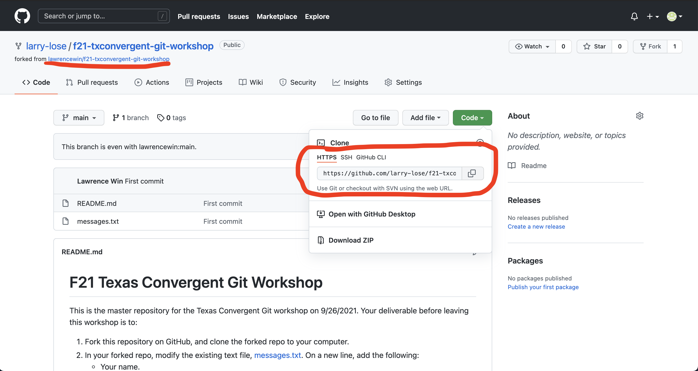
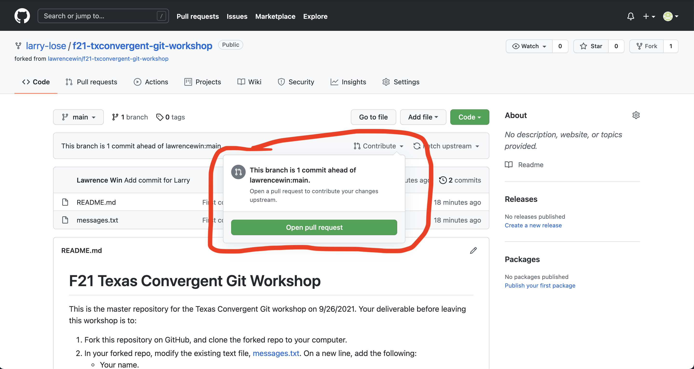
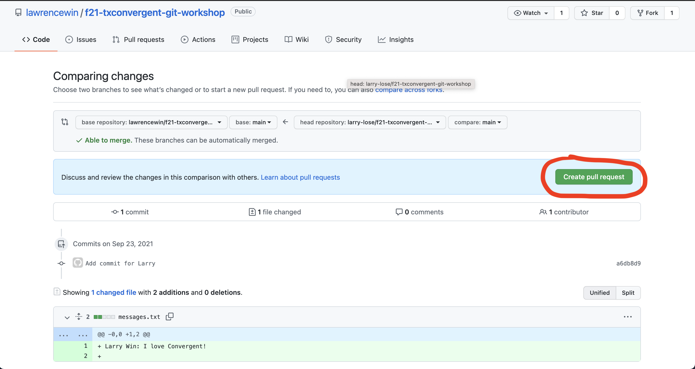

# F21 Texas Convergent Git Workshop

This is the master repository for the Texas Convergent Git workshop on 9/26/2021. Your deliverable before leaving this workshop is to:

1. Fork this repository on GitHub.

2. Clone the forked repository onto your computer. The terminal command is `git clone <insert forked repo url here>`

3. In your forked repo, modify the existing text file, [messages.txt](messages.txt). On a new line, add the following: 
    - Your name.
    - Your github username.
    - Your build team (AI, Data, Austin, Health, Business).
    - A short message to show that you were here.
4. Once you've saved your work, create a new commit (`git commit -m "<commit message here>"`) and push your commit (`git push`).
5. In GitHub, create a new pull request from your forked repository to your main repository. 

6. Once your pull request is approved, you're good to leave!
